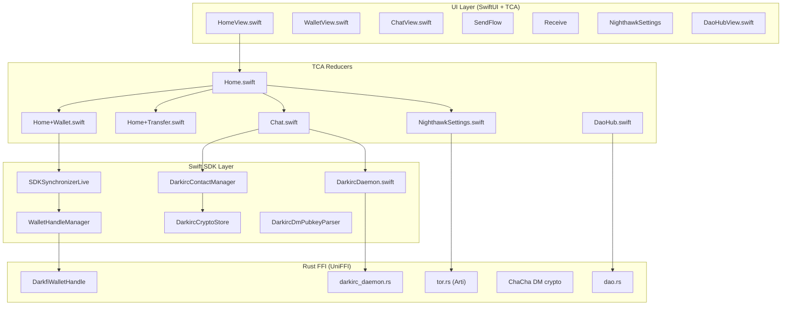

# DarkFi iOS Architecture & Feature Walkthrough

This document serves as a comprehensive guide for developers understanding the integration of DarkFi P2P technologies within the Nighthawk iOS Wallet. It explains the core architecture, the TCA (The Composable Architecture) state management, and the Rust UniFFI bridging layer.

## 1. High-Level Architecture

The DarkFi iOS wallet replaces legacy Zcash dependencies with the native DarkFi P2P network, utilizing an embedded full-node daemon (`drk`). The architecture consists of three main layers:

1. **UI Layer (SwiftUI + TCA)**: Manages view state, user actions, and routing.
2. **Swift SDK & Bridge Layer (`SDKSynchronizerLive` + feature reducers)**: Wraps the raw FFI calls into idiomatic Swift `Combine` publishers, `AsyncStream` streams, and async/await interfaces.
3. **Rust FFI Layer (`darkfi-mobile-ffi`)**: The static Rust library compiling the upstream `drk` daemon, exposing a UniFFI bridging interface (`libdarkfi_mobile_ffi.a`).

> [!NOTE]
> The embedded Rust node runs natively in the background. P2P syncing, cryptography, zero-knowledge proofs (halo2), and consensus are handled entirely within the Rust layer.

---

## 2. Module Dependency Diagram



---

## 3. Wallet Integration Walkthrough

The Wallet feature handles scanning blocks, managing balances, creating transfers, and fetching transaction history.

### How It Works:
- **`SDKSynchronizerLive.swift`**: This file hosts `WalletHandleManager`, a singleton that instantiates `DarkfiWalletHandle` over UniFFI. It creates a `Combine` stream (`CurrentValueSubject<SynchronizerState, Never>`) that continuously updates the iOS UI whenever block height or confirmed balance changes.
- **TCA Reducers (`Wallet.swift` & `Home.swift`)**:
  - `Home.swift` kicks off `.listenForSynchronizerUpdates` which subscribes to the `SDKSynchronizer` state stream.
  - As new blocks sync, `Home.swift` receives `.synchronizerStateChanged(SynchronizerState)` and updates `walletInfo.totalBalance` and `walletInfo.latestMinedHeight`.
  - The UI (e.g., `WalletView.swift`) seamlessly updates via the TCA `@ObservableState`.

### Key FFI Methods used:
- `handle.refreshNow()`: Asks the daemon to pull new blocks from the P2P network.
- `handle.confirmedBalanceAtomic()`: Fetches the total balance for the primary address.
- `handle.listTransactions()`: Retrieves decoded history.
- `handle.listTokenBalances()`: Multi-token portfolio.
- `handle.buildTransfer(...)`: Construct signed transaction.
- `handle.broadcastTransfer(...)`: Submit to network.
- `handle.estimateTransferFee(...)`: Fee preview.

---

## 4. DarkIRC Chat Feature Walkthrough

DarkIRC provides end-to-end encrypted (E2E), anonymous chatting over the DarkFi DAG (EventGraph). Unlike the standalone desktop version which runs a local TCP/IRC server, iOS uses **native callback bridging** to circumvent iOS App Sandbox and background execution limits.

### How It Works:
- **`DarkircDaemon.swift`**: Manages the Chat daemon (`start_darkirc`). It passes a native Swift object `ChatEventRelay` into the Rust FFI.
- **`DarkircEventCallback` (UniFFI Protocol)**:
  - The Rust daemon listens to the EventGraph for new P2P messages.
  - When a message arrives, Rust executes `callback.on_message(...)` which directly invokes the Swift method `ChatEventRelay.onMessage()`.
  - `ChatEventRelay` yields the message into an `AsyncStream.Continuation`.
- **TCA Reducer (`Chat.swift`)**:
  - Subscribes to the `AsyncStream` using `.run { send in for await msg in ... }`.
  - Dispatches actions (`.didReceiveMessage`) back to the main TCA loop to update the `Chat.State`.
- **UI (`ChatView.swift`)**:
  - Displays the active channels, DMs, and real-time chat bubbles via TCA state bindings.

### Sending Messages:
When a user types a message and hits send, the TCA action `.sendMessage` invokes `send_chat_message(channel:nick:message:)` (same signature as Android). This is an FFI call that builds an `EventGraph` `Event` carrying an upstream-compatible `Privmsg`, inserts it into the Header DAG + DAG (keyed by the genesis timestamp), and broadcasts it to the P2P network.

### DM (Direct Messages):
- **Contact management**: `DarkircContactManager` + `DarkircCryptoStore` manage E2E contacts.
- **Key generation**: `generate_dm_keypair()` → `DmKeypair { secret_b58, public_b58 }`.
- **Encryption**: `chacha_encrypt_dm(my_secret, their_public, plaintext)`.
- **UI**: `NewDmConversationView` for adding contacts; `DarkircDmPubkeyParser` for extracting keys from public messages.

See [DarkIRC on iOS](darkirc-ios.md) for the full in-process architecture.

---

## 5. DAO Hub Feature

Read-only DAO governance hub:

- **FFI**: `list_daos()`, `list_proposals(dao_name?)`, `get_proposal(proposal_bulla_b58)` on `DarkfiWalletHandle`.
- **TCA**: `DaoHub.swift` reducer with state for DAO list, selected DAO, proposals.
- **UI**: `DaoHubView.swift` — hub → DAO detail → proposal detail navigation.

---

## 6. Tor / Arti Integration

iOS uses **Arti** (Rust implementation of Tor) for in-process Tor:

- **`start_arti_proxy(socks_port)`**: Starts Arti SOCKS proxy on specified port.
- **`stop_arti_proxy()`**: Shuts down the proxy.
- **`is_arti_running()`**: Check proxy status.

This is an **iOS-specific advantage** — Android uses Guardian Project's `tor-android` as a separate process with SOCKS. iOS runs Tor entirely in-process, simplifying lifecycle management.

Settings: **Settings → Tor Network** (`TorNetwork` feature).

---

## 7. TCA (The Composable Architecture) Router

The main navigation of the app relies on the `NighthawkTabBar` and `HomeView.swift`.

- **`HomeView.swift`** wraps a standard `TabView` controlled by `store.selectedTab`.
- **Reducers**: `Home.swift` scopes the tabs into their respective child reducers:
  ```swift
  Scope(state: \.wallet, action: \.wallet) { Wallet() }
  Scope(state: \.transfer, action: \.transfer) { Transfer() }
  Scope(state: \.chat, action: \.chat) { Chat() }
  Scope(state: \.settings, action: \.settings) { NighthawkSettings() }
  ```
- **Settings sub-features**: About, Advanced, ChangeServer, ChatSettings, ExternalServices, Fiat, Notifications, Security, TorNetwork.

---

## 8. Project Structure

```
nighthawk-ios-wallet/
├── stealth.xcodeproj/          # Xcode project
├── stealth/                     # App target
├── stealthTests/                # Test target
├── modules/Sources/
│   ├── Features/
│   │   ├── Home/                # Main tab container
│   │   │   ├── Chat/           # DarkIRC chat (public + DM)
│   │   │   ├── DaoHub/         # DAO governance hub
│   │   │   ├── Wallet/         # Balance, sync
│   │   │   ├── Transfer/       # Send flows
│   │   │   └── NighthawkSettings/  # Settings hub
│   │   ├── Addresses/          # Address management
│   │   ├── Receive/            # Receive QR
│   │   ├── SendFlow/           # Send transaction flow
│   │   ├── TransactionDetail/  # Tx details
│   │   └── ...                 # Onboarding, import, export
│   └── ...
├── rust/
│   ├── Cargo.toml              # Workspace (patches for halo2, url)
│   ├── darkfi-mobile-ffi/      # UniFFI static library
│   │   └── src/
│   │       ├── lib.rs          # Main entry
│   │       ├── darkfi_mobile_ffi.udl  # Interface definition
│   │       ├── darkirc_daemon.rs      # In-process darkirc
│   │       ├── tor.rs          # Arti Tor proxy
│   │       ├── dao.rs          # DAO read APIs
│   │       └── ...
│   └── darkfi-android-bridge/  # Legacy (unused)
├── third_party/
│   └── darkfi/                 # Vendored upstream darkfi
├── scripts/
│   ├── build-darkfi-mobile-ffi-ios.sh
│   └── build-darkirc-ios.sh
├── docs/                       # Project documentation
└── images/                     # App screenshots
```

---

## 9. Development Guidelines

> [!IMPORTANT]
> If you make changes to the Rust FFI functions in `darkfi-mobile-ffi/src/lib.rs`, you **must** update the `darkfi_mobile_ffi.udl` and run the build script so that UniFFI generates the matching Swift bridging headers.

- **Background Tasks**: Ensure long-running Rust loops (like the `darkirc` daemon or blockchain sync) are spawned inside a `smol::Executor` on an independent thread, so they do not block the iOS main queue or Swift structured concurrency runtime.
- **Dependency Management**: iOS dependencies like `halo2_gadgets` are patched at the `rust/Cargo.toml` root level using specific branches (`v050`). Do not patch dependencies in the sub-crates.
- **TCA Conventions**: Follow the patterns documented in [`CODE_STRUCTURE.md`](../CODE_STRUCTURE.md) — State/Action/Reducer in `<Feature>.swift`, View in `<Feature>View.swift`.
- **AI Agents**: See [`AI_CONTEXT.md`](../AI_CONTEXT.md) for coding rules specific to this project.

---

## 10. Related Documentation

- [`darkfi-integration.md`](darkfi-integration.md) — Full integration architecture and upstream parity
- [`darkirc-ios.md`](darkirc-ios.md) — In-process DarkIRC details
- [`app-features.md`](app-features.md) — Feature catalog
- [`implementation-plan.md`](implementation-plan.md) — P0–P4 task list
- [`security-threat-model.md`](security-threat-model.md) — Security model
- [`alpha-testnet-connection.md`](alpha-testnet-connection.md) — Testnet guide
